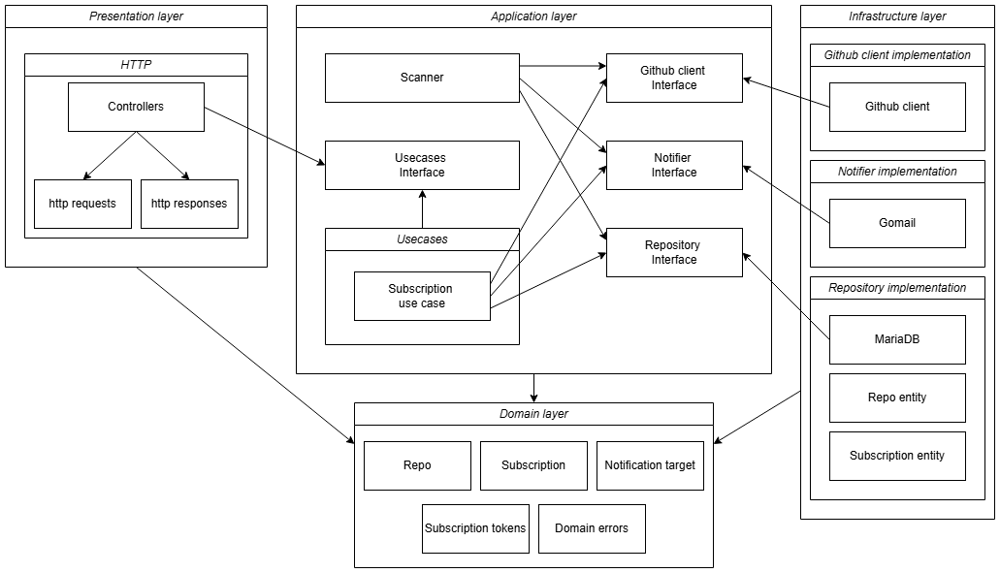

# github-releases-notifier


A REST API application that allows users to subscribe to email notifications about new releases of a chosen Github repository.

## Workflow

On startup server loads configuration, connects to db, runs migrations. All dependencies are wired up: database connection instance, Github API client, SMTP notifier, repository, handler, usecase, and scanner. Passed down the chain via constructor injection.

Two things work concurrently:

- **HTTP server** handles subscription management: subscribe, confirm, unsubscribe, get by email.
- **FixedRateScanner** runs in a goroutine, polling Github for new releases at a steady, controlled rate depending on github API token presence.

## Architecture of the application

### Written following clean architecture principles:

- Easy to expand
- More convenient to test
- Easy to change external dependencies
- etc.

### Diagram:


## Response format

Response on `/subscriptions` is in format `[Subscription]`

Other responses return JSON in the format:

```json
{
  "status": "error",
  "message": "Validation failed",
  "details": {
    "email": "value is empty",
    "repo": "bad_repo is invalid github repo, must be in owner/repo format"
  }
}
```

`status` is always present - "success"/"error". `message` is also always included. `details` is only included if request body in correct format failed validation, where each key is the JSON field name that failed and value carries descriptive message.

## How to run

Create `.env` file (use `.env.example` as an example)

```bash
docker compose up --build
```

## API

| Method | Endpoint | Description |
|---|---|---|
| `POST` | `/api/subscribe` | Subscribe to release notifications |
| `GET` | `/api/confirm/:token` | Confirm email subscription |
| `GET` | `/api/unsubscribe/:token` | Unsubscribe from release notifications |
| `GET` | `/api/subscriptions?email=` | Get subscriptions for an email |

## Tests

**Unit tests** cover all business logic in the `usecase` and `scanner` packages with all dependencies replaced by mocks.

**Integration tests** run against a real MariaDB instance spun up via Testcontainers, with the GitHub client and notifier mocked.

```bash
# Unit tests only
go test -v -short ./...

# Integration tests only (requires Docker for Testcontainers)
go test -v -count=1 -race -timeout 15m ./internal/integration/...
```

## CI

Every push runs two jobs via GitHub Actions:

- **Lint** — runs `golangci-lint` for code quality
- **Test** — runs unit tests with `-short` flag first, then integration tests separately against a real database instance
